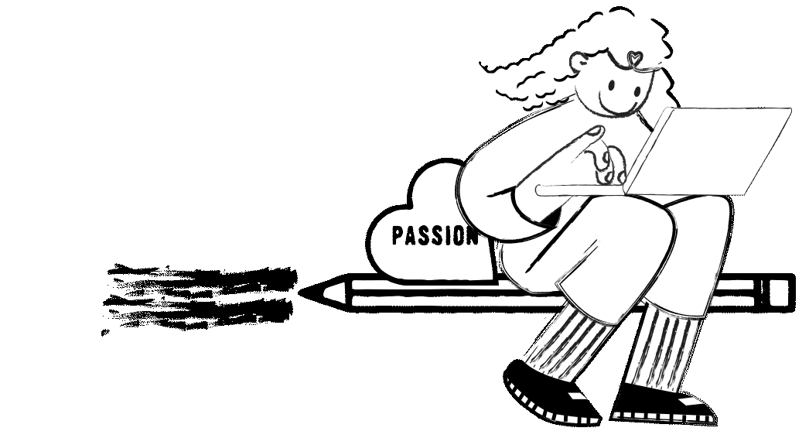

# Portfolio_작업일지

## Project_Portfolio 기록

__230801~230802 : Tim Walker 슬라이드__

    특이한 슬라이드
    -> 평소에 본적없는 특이한 슬라이드라 레퍼런스를 열심히 찾아보았지만 못찾음
    -> 기존 사이트 이벤트 분석 시도
    -> 거듭된 실패에 비슷하게 구현 : ScrollTrigger, height, transfrom: scale3d 값으로 구현

__230731 : Tim Walker 웹 글자이벤트__

    글자이벤트 추가
    -> unpkg: npm 패키지들을 올려둔 CDN을 사용하여 글자 이벤트

__230730 : Tim Walker 웹 JavaScript & jQuery__

    분석한 움직임을 토대로 작업 시작
    -> 위치값에 따른 배경색상 변화
    -> 마우스 커서 변경(커서 모양 변경및 호버 이벤트, 특정영역 커서 스타일 변경)
    -> 위치값에 따른 배경색상 변화
    -> 스크롤 이벤트: 스크롤 다운-확대, 스크롤 업-축소
    -> 스크롤시 이미지 변경: attr 속성변경
    -> upto 버튼 부드러운 움직임 

__230729 : Tim Walker 웹 HTML, CSS__

    웹 구조와 스타일값 완성 
    -> 필요한 소스 추가 작업

__230728 : Tim Walker 웹 시안작업__

    자료 조사, 이미지 수집, 레이아웃 구성 
    -> 작업에 필요한 내용 정리 및 이미지 수집, 편집
    
    홈페이지의 움직임 분석
    -> 동적 움직임에 따른 효율적인 구성을 위해 분석 우선진행
    -> 기술 내용 기록, 레퍼런스 조사

__230727 : 팀 프로젝트 HTML, CSS__

    설명페이지 html, css 
    -> 구조와 스타일값 완성, 추가로 필요한 이미지 작업
    -> svg, hover 이벤트 추가

__230726 : 팀 프로젝트 설명페이지__

    설명페이지 시안 작업
    -> 개인 작업 영역 기술정리
    -> 작업시 중점이 되었던 내용정리

__230725 : UXUI RENEWAL HTML, CSS__

    설명페이지 html, css 
    -> 구조와 스타일값 완성, 추가로 필요한 이미지 작업
    -> hover 이벤트 추가

__230723 : Media Query 반응형웹 설명페이지 HTML, CSS, JavaScript__

    설명페이지 html, css 
    -> 구조와 스타일값 완성, 추가로 필요한 이미지 작업
    -> svg, hover 이벤트 추가

__230720 : UXUI RENEWAL DESIGN 설명페이지 시안작업__

    설명페이지 시안 작업
    -> 진행과정과 결과에 대해 효율적으로 정리가 될 수 있는 방향

__230719 : UXUI RENEWAL DESIGN 설명페이지 내용 정리__

    UXUI RENEWAL 진행시 중점을 두었던 부분에 대한 정리
    -> Research: 백그라운드, 사용자분석, 경쟁앱 분석
    -> 기존앱 분석과 사용자 니즈

    스타일가이드 정리

    진행과정과 결과에 대한 분석

__230718 : Media Query 반응형웹 설명페이지 내용 정리 및 시안__

    반응형웹
    -> Pc, 테블릿, 모바일에 대응할 수 있도록 레이아웃 설계에 대한 내용 작성

    브랜드에 대한 내용 정리
    -> 카페 서울앵무새 작업 진행시 조사, 분석한 내용 작성

    Renewal Direction 
    -> 카페 서울앵무새 작업 진행시 조사, 분석한 내용 작성

    정리된 내용을 토대로 시안작업

__230717 : 풋터 수정 및 포트폴리오 설명페이지__

    완성된 시안을 토대로 풋터 수정
    -> 깃허브 링크 2개를 추가하여 풋터 정렬

    설명페이지 html, css 
    -> 구조와 스타일값 완성, 추가로 필요한 이미지 작업 진행 예정

__230716 : 포트폴리오 풋터 수정 계획__

    레퍼런스 조사 및 레이아웃 구상
    -> 현재 보다 심플한 구성에 내용을 추가할 수 있는 형태의 풋터구상

__230715 : 설명페이지 가이드 완성__

    가이드 완성을 토대로 내용작성
    -> 꼭 필요한 내용을 기반으로 내용 작성 및 이미지 편집

__230714 : 설명페이지 컨셉 및 초안__

    설명페이지 컨셉 설정, 초안
    -> 현재 포트폴리오의 장점을 살리고, 설명페이지의 내용도 요약하여 잘 반영될 수 있는 시안 구상

__230713 : about 페이지__

    svg 애니매이션 작업 실패
    -> 상단 영역 이후, 스크롤시 svg 요소의 움직임을 자바스크립트로 제어 시도
    -> 내가 만들어 svg 파일로 만든 파일이 길고 패스 제어가 힘들었다
    -> 움직임은 주었으나 원하는 요소 중 하나에만 적용을 했고, 추가로 svg를 넣어 만들려고 하니 html 구조가 너무 길어졌다
    -> 영상이나 gif 파일이 훨씬 더 간단하다는 생각이 들었다. 

__230712 : index 페이지 스타일 완성__

    전체적인 레이아웃 완성 및 움직임 동적 이벤트 추가
    1. svg 스크롤 이벤트 추가
    2. footer 영역 hover 시, 타이핑 시작
    3. attr로 텍스트 선택시 이미지 src 속성 변경

__230629 : 섹션.슬라이더 스크롤이벤트__

    특정부분에 스크롤이벤트를 실행하여 애니메이션 효과를 더해주기
    1. scrollY로 이벤트 실행할 위치값을 설정해 주었다.
    2. 여기서 문제점 발견!! 너무 빨리 지나가서 스크롤이 끝나기전에 이 영역을 벗어나게 하고 싶지 않았다.
    3. 검색 후, Scrolltrigger Pin을 사용하면 원하는 것을 적용할 수 있을것으로 확인되었지만 적용하지 못했다.
    -> 다시 적용을 시도해 볼것이다

__230628 : 오류 수정하기__

    스타일 완성후, 개발자 모드에서 확인 된 오류
    1. 서체 연결: 경로설정을 바꿔주었다. 앞으로 꼭 한번 더 확인하기 
    2. 이미지 이름 변경 안됨: 대문자를 소문자로 변경해줬는데 적용이 안되어서 이미지가 사라지는 일이 발생했다. 결국 수정이 안되어 css에 작성된 이름을 변경해주었다.

__230627 : 작성된 메인페이지 스타일만들기__

    style.css, variable.css 작성

__230626 : 포트폴리오 index 페이지 디자인 변경__

    변경된 시안에 맞춰 index.html 작성

__230625 : 포트폴리오 구성 수정__

    포트폴리오 방향성
    -> 어떤 컨셉으로 어떻게 전달되길 바라는지 생각정리
    -> 브랜딩 방향 정하여 로고 작업 시작

    포트폴리오 구성 정리 
    -> index.html 작성, 이미지 정리
    -> 포트폴리오 구성 수정에 따른 seoul-angmusae 웹 경로 수정

## Project_서울앵무새 기록

__230625 : 서울앵무새 경로수정__

    포트폴리오 구성 수정에 따른 seoul-angmusae 웹 경로 수정

__230608 : 서울앵무새 PC, 모바일 디자인작업 완료__

    디자인방향
    -> 서울앵무새의 느낌을 살리기 위해 원색의 색감을 살려 작업을 진행
    -> 캐릭터를 최대한 살리기 위해 영상작업 및 일러스트 작업 추가

__230613 : 모바일 작은버젼과 테블릿 버젼 작업, 디테일 수정__

    미디어쿼리는 어렵지만 재밌다
    -> 되도록 다양한 사이즈에 대응이 되도록 수정
    -> 사이즈 별로 디자인 작업 디테일 수정
